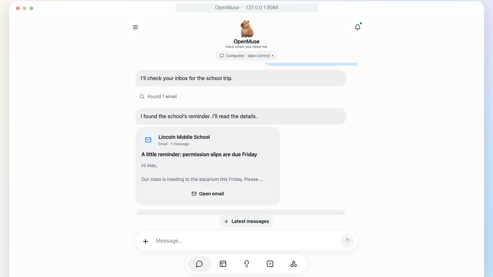
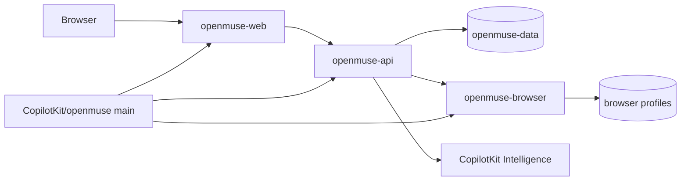

<div align="center">

# OpenMuse on Render

A personal agent with a browser you can take over, files, and tasks that keep running. This repo is the Blueprint. The app is built from [CopilotKit/openmuse](https://github.com/CopilotKit/openmuse) `main`.

<p>
  <a href="https://render.com/deploy-template/api/github/start?template_repo=openmuse">
    
  </a>
</p>

<p>
  <a href="https://render.com">
    
  </a>
  <a href="https://github.com/CopilotKit/openmuse">
    
  </a>
  <a href="https://github.com/CopilotKit/openmuse/blob/main/LICENSE">
    
  </a>
</p>

</div>



## What This Template Shows

This repository does not contain the OpenMuse source. Each service sets `repo: https://github.com/CopilotKit/openmuse` and `branch: main`, so Render clones upstream to build. A push to that branch redeploys the services. Plan, disk, and environment changes are commits in this wrapper.

| Piece | Role |
| --- | --- |
| **[OpenMuse](https://github.com/CopilotKit/openmuse)** | MIT app: Hono API, Expo web UI, Playwright worker. Built from `main`. |
| **[Render Web Service](https://render.com/docs/web-services)** | `openmuse-api` on the Node runtime. In-process task worker. PGlite on a disk. |
| **[Render Static Site](https://render.com/docs/static-sites)** | `openmuse-web`. Expo web export from the same upstream repo. |
| **[Render Private Service](https://render.com/docs/private-services)** | `openmuse-browser`. Chromium from `apps/worker/Dockerfile`. No public URL. |
| **[Persistent disks](https://render.com/docs/disks)** | Workspace database, PDFs, and signing key on the API. Browser profiles on the worker. |

## Architecture



### How It Works

1. Click **Deploy to Render**. The flow forks this wrapper into your GitHub account and applies [`render.yaml`](./render.yaml).
2. On Apply, set `CPK_INTELLIGENCE_API_KEY` and `OPENAI_API_KEY`. Render generates the access key, the encryption key, and the browser token.
3. Render clones `CopilotKit/openmuse` at `main` for the API, the static export, and the browser image.
4. Open the `openmuse-web` URL and sign in with `OPENMUSE_ACCESS_KEY` from the API service.
5. Later commits on upstream `main` redeploy those three services. Editing this wrapper changes the Blueprint, not the app source.

| Resource | Type | Plan | Notes |
| --- | --- | --- | --- |
| `openmuse-api` | Web, Node | Standard | Disk at `/var/data`, 1 GB. Health: `/api/health`. Single instance. |
| `openmuse-web` | Static | Free | Publish path `apps/mobile/dist/web` in the upstream repo. |
| `openmuse-browser` | Private, Docker | Standard | `apps/worker/Dockerfile`. Listens on 8790. Disk at `/data`, 1 GB. |

Default region: **Oregon**. Both disks are single-instance. The Linux computer in `apps/computer` is not in this Blueprint: it needs a Docker engine beside the API.

## Quick Start

### Prerequisites

- A [Render account](https://dashboard.render.com/register?utm_source=github&utm_medium=referral&utm_campaign=ojus_demos&utm_content=readme_link)
- A CopilotKit Intelligence project key: `npx copilotkit@latest login`, then `npx copilotkit@latest project select`
- An OpenAI API key if you leave `MODEL=openai/gpt-5`

### Deploy

1. Click **Deploy to Render** above.
2. Fill in `CPK_INTELLIGENCE_API_KEY` and `OPENAI_API_KEY`.
3. Wait until `openmuse-api`, `openmuse-web`, and `openmuse-browser` are **Live**.
4. Copy `OPENMUSE_ACCESS_KEY` from `openmuse-api` and sign in on the static site.

```bash
curl -fsS "https://<openmuse-api>.onrender.com/api/health"
```

The API origin returns JSON. The web app is the static site.

## Features

| Feature | Description |
| --- | --- |
| **Chat** | CopilotKit headless chat. One access key for the workspace. |
| **Tasks** | Plans, pause, resume, cancel, retry, and approvals. |
| **Browser** | Persistent Chromium profiles. **Take control** opens the same session. |
| **Documents** | PDFs on the API disk. |
| **Upstream builds** | Services track `CopilotKit/openmuse` `main` without copying that repo here. |

This deployment is one owner behind a shared access key.

## Configuration

| Variable | Source | Description |
| --- | --- | --- |
| `CPK_INTELLIGENCE_API_KEY` | Required | Server-only CopilotKit Intelligence key. |
| `OPENAI_API_KEY` | Required | Used by `MODEL=openai/gpt-5`. |
| `OPENMUSE_ACCESS_KEY` | Auto-generated | Sign-in secret. |
| `TOKEN_ENCRYPTION_KEY` | Auto-generated | 32-byte base64 key. Do not rotate it after Google tokens are stored. |
| `WORKER_TOKEN` | Auto-generated | Shared by the API and the browser worker. |
| `BROWSER_WORKER_URL` | Blueprint | `http://openmuse-browser:8790`. |
| `PUBLIC_API_URL` | Wired | API `RENDER_EXTERNAL_URL`. |
| `ALLOWED_ORIGINS` | Wired | Static site origin. |
| `EXPO_PUBLIC_API_URL` | Wired | Baked into the web bundle at build time. |
| `NODE_VERSION` | Blueprint | `24` on the API and the static build. |
| `GOOGLE_CLIENT_ID` | Optional | Add on `openmuse-api` with `GOOGLE_CLIENT_SECRET`. Redirect: `${PUBLIC_API_URL}/api/google/callback`. |

`generateValue` runs once, on the first Blueprint apply.

## Cost

Prices from [Render's pricing page](https://render.com/pricing). CopilotKit Intelligence and the model provider bill separately.

| Resource | Approx. monthly |
| --- | ---: |
| `openmuse-api` (Standard, 2 GB) | $25 |
| `openmuse-browser` (Standard, 2 GB) | $25 |
| `openmuse-web` (static) | $0 |
| Two 1 GB disks | $0.50 |
| **Total** | **~$50.50** |

Standard is the floor for both compute services. Starter (512 MB) OOM-kills the API during PGlite startup.

## Troubleshooting

| Problem | Solution |
| --- | --- |
| `No open ports` / heap OOM on the API | Stay on Standard. Starter is too small for PGlite. |
| Health check fails on the API | `GET /api/health`. Confirm `CPK_INTELLIGENCE_API_KEY` is set. |
| Browser service never opens a port | It listens on **8790**, not `$PORT`. `WORKER_HOST` must stay `0.0.0.0`. |
| Web app calls the wrong host | `EXPO_PUBLIC_API_URL` is fixed at export time. Redeploy `openmuse-web` after the API URL exists. |
| Upstream fix is not running | Services build `CopilotKit/openmuse` `main`. Confirm that branch has the commit, then check the service deploy, not this wrapper's history. |

## Project Structure

```
render.yaml       Blueprint. Service repos point at CopilotKit/openmuse.
README.md         This file
LICENSE           Wrapper license
.env.example      The two secrets the deploy form asks for
assets/hero.png   Upstream web demo still
```

## Learn More

**Render:**

- [Blueprint spec](https://render.com/docs/blueprint-spec) (`repo` selects the Git repository to build)
- [Private network](https://render.com/docs/private-network)
- [Persistent disks](https://render.com/docs/disks)

**Upstream:**

- [OpenMuse](https://github.com/CopilotKit/openmuse)
- [CopilotKit Intelligence](https://docs.copilotkit.ai/intelligence/connect-your-runtime)

## License

[MIT](LICENSE) for this wrapper.

Upstream [OpenMuse](https://github.com/CopilotKit/openmuse) is MIT. CopilotKit Intelligence is a separate service and is not covered by that license.
